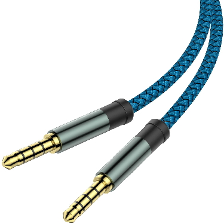
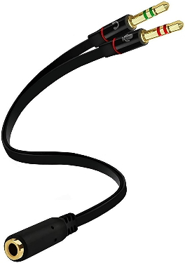

# Mic Audio Playback
A simple audio playback app for quickly testing audio on a Playdate. The app is intended for recording audio over [an audio cable](#supported-audio-cable) but you can also record input from the Playdate's built-in mic.

NOTE: The Playdate SDK does not currently support realtime playback from mic input. This app is designed to first record audio from mic input, then played back over the speaker.

## Quickstart
1. [Install the app](#install).
1. Take your [splitter](#mic-headphone-splitter) and plug the _mic_ end into your computer's _headphone_ jack.
1. Plug the female end of your splitter into your [AUX cable](#trrs-35mm-aux-cable).
1. Plug the other end of your AUX cable into your Playdate.
1. Play audio on your computer i.e. open your game in the Simulator or Pulp.
1. Press A to start recording audio on your Playdate.
1. After a few moments, press B to playback the audio over the Playdate's speakers.
1. Use the crank to adjust the gain/volume.

## Install
Download the [latest release](https://github.com/GamesRightMeow/micaudioplayback/releases) or [build](#build) the project locally. Then refer to [the official Panic documentation about sideloading games](https://help.play.date/games/sideloading/).

## Build
If using VS Code, there are 3 tasks configured in [tasks.json](/.vscode/tasks.json):
- `buildPdx`: builds the PDX from the `src` folder.
- `runSimulator`: runs the built PDX in the Playdate Simulator.
- `buildRunSimulator`: runs `buildPdx` then `runSimulator`.

Otherwise, see [the official Panic documentation on compiling and running a Playdate project](https://sdk.play.date/Inside%20Playdate.html#_compiling_a_project).

## Supported audio cable
In order to correctly send audio to your Playdate you need two cables:

### TRRS 3.5mm AUX cable

An AUX cable with TRRS (Tip, Ring, Ring, Sleeve) 3.5mm audio connectors on both ends. This type of cable supports sending stereo audio as well as mic input. You can usually identify these cables by checking if there are 3 rings around the tip of the connector.

### Mic headphone splitter

Also known as a headset splitter or headphone splitter. The cable should have a TRRS female jack on one end, and two TRS male ends on the other. One for mic and one for headphones.

This is needed because the mic line in a TRRS cable does not _normally_ cross over into headphone line. The splitter allows you to re-direct the audio out from your computer to the mic input on your cable which is then routed into the mic input on your Playdate.